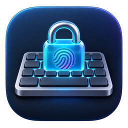

# KeyboardLock



A tiny native macOS utility that lets you clean your keyboard without triggering a single key.

[](https://github.com/ashnurkoff/KeyboardLock/actions/workflows/ci.yml)


[](LICENSE)

KeyboardLock lives in the menu bar and temporarily suppresses keyboard input across macOS. Your mouse and trackpad remain active, so you can unlock with Touch ID, a deliberate ten-second mouse hold, or the automatic safety timer.

## Features

- Blocks letters, modifiers, shortcuts, media keys, and other keyboard events system-wide.
- Keeps mouse and trackpad input available at all times.
- Unlocks through Touch ID after an intentional mouse click.
- Provides a ten-second mouse-hold fallback when Touch ID is unavailable.
- Automatically restores input after one, three, or five minutes.
- Runs as a lightweight menu-bar app without a Dock icon.
- Supports Apple silicon and Intel Macs running macOS 13 or newer.

## Privacy by design

KeyboardLock does not collect, store, or transmit keystrokes, fingerprints, biometric records, analytics, or any other personal data.

Touch ID matching is performed entirely by macOS and the Secure Enclave. The app receives only a success-or-failure result from Apple's `LocalAuthentication` framework; it cannot access fingerprint images or templates. Keyboard events are discarded in memory while the lock is active and are never logged. The project contains no networking or telemetry code.

The only saved preference is the selected safety-timer duration. See [Privacy](docs/PRIVACY.md) for the complete data-handling statement.

## Installation

### Build from source

Prebuilt, notarized downloads are not available yet. Building locally takes a few minutes.

Requirements:

- macOS 13 Ventura or newer
- Xcode 15 or newer
- [Homebrew](https://brew.sh) and [XcodeGen](https://github.com/yonaskolb/XcodeGen)

```bash
brew install xcodegen
git clone https://github.com/ashnurkoff/KeyboardLock.git
cd KeyboardLock
make run
```

`make run` generates the Xcode project, creates an unsigned local build, and launches it. For a stable local signing identity that macOS can remember between rebuilds, configure your Apple Development team and use:

```bash
DEVELOPMENT_TEAM=YOUR_TEAM_ID make signed-run
```

You can also run `make generate`, open `KeyboardLock.xcodeproj`, and select your team under **Signing & Capabilities**. See [Building](docs/BUILDING.md) for the complete setup.

## First launch

KeyboardLock needs Accessibility access because macOS protects system-wide input filtering.

1. Launch KeyboardLock. A keyboard icon appears in the menu bar.
2. When prompted, open **System Settings → Privacy & Security → Accessibility**.
3. Enable KeyboardLock. If it was already listed but remains untrusted, remove the stale entry and add the current app again.
4. Return to the menu-bar icon and choose **Lock keyboard**.

The permission allows KeyboardLock to suppress keyboard events. The app does not inspect, record, or transmit what you type.

## Usage

1. Choose a one-, three-, or five-minute safety timer from the menu-bar menu.
2. Select **Lock keyboard**.
3. Clean the keyboard while the floating lock panel is visible.
4. Unlock by clicking **Unlock with Touch ID**, holding the fallback control with the mouse for ten seconds, or waiting for the timer.

The power/Touch ID button is intentionally not blocked. KeyboardLock is a cleaning utility, not a replacement for the macOS lock screen or a security boundary.

## Troubleshooting

### Accessibility permission keeps appearing

macOS associates Accessibility trust with the app's identity and location. Keep the app at a stable path and use a consistent signing identity. Remove obsolete KeyboardLock entries from **Privacy & Security → Accessibility**, add the current build, then relaunch it.

### Touch ID is unavailable

Make sure Touch ID is configured in System Settings. macOS may temporarily require your account password after a restart or several failed attempts; the ten-second mouse hold and safety timer remain available.

### A key is not blocked

Please open a [bug report](https://github.com/ashnurkoff/KeyboardLock/issues/new?template=bug_report.yml) with your macOS version, Mac model, and whether the keyboard is built in or external. Never include passwords or other text you typed.

## Development

```bash
make test      # Generate the project and run unit tests
make build     # Build a universal unsigned Release app
make analyze   # Run Xcode's static analyzer
make check     # Run all three checks
```

The generated app is written to `build/Build/Products/Release/KeyboardLock.app`.

## Documentation

- [Architecture](docs/ARCHITECTURE.md)
- [Building and local development](docs/BUILDING.md)
- [Privacy](docs/PRIVACY.md)
- [Release process](docs/RELEASE.md)
- [Behavior specification](docs/SPEC.md)
- [Contributing](CONTRIBUTING.md)
- [Security policy](SECURITY.md)

## Contributing

Issues and pull requests are welcome. Please read [CONTRIBUTING.md](CONTRIBUTING.md) before making a change, especially the input-safety and privacy requirements.

## License

KeyboardLock is available under the [MIT License](LICENSE).
